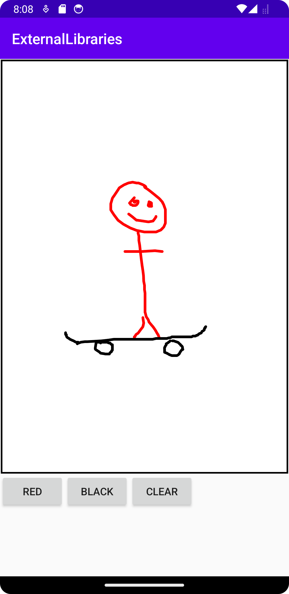
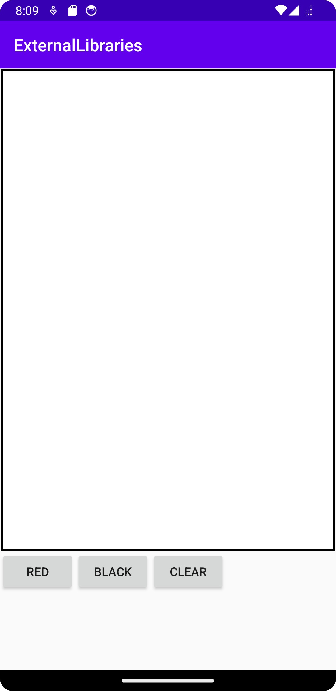

# Rapport
Projektet började med att lägga till jitpack.io i build.cradle repositorys. Detta gör att man kan använda sig av librarys som ligger på github. Därefter lades "implementation 'com.github.Luciferx86:DoodleCanvasLibrary:0.1.0-alpha3'" till i build.cradle dependencies. Det är ett library som gör det möjligt att lägga in en view (ett canvas) som det går att rita på.  
Efter det lades den viewen in i layoutfilen för appen så att ett canvas existerar. En LinearLayout lades till som omslöt canvas viewen så att canvaset bara tar upp 80% av skärmen.   
Tre knappar lades sedan till under canvaset som var: "red", "black" och "clear".  
De tre knapparna fick sedan varsin onclicklistener i MainActivity.java, där "red" och "black" ändrade färgen som används i canvaset till sina färger, och "clear" tar bort allting som målats hittils i canvaset.  
Package repository: https://jitpack.io/  
Användt Git library: https://github.com/Luciferx86/DoodleCanvasLibrary  
# Kod
```
canvas = findViewById(R.id.doodleCanvas);

Button redButton = findViewById(R.id.redButton);

redButton.setOnClickListener(new View.OnClickListener() {
  @Override
  public void onClick(View view) {
  canvas.setStrokeColor(Color.RED);
  }
});
```
Ett exempel på vad en av knapparna gör. Först identifieras canvaset, sedan identifieras knappen, och slutligen sätts canvasets målarfärg till röd med metoden setStrokeColor(). Den metoden hängde med det importerade libaryt.
# Bilder


